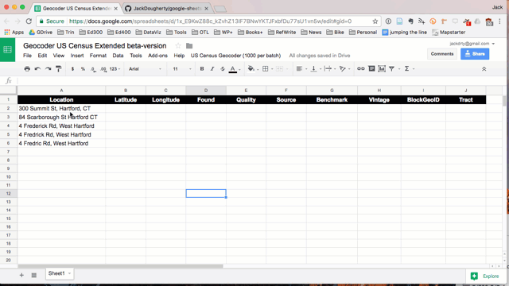

# Google Sheets Geocoder
Geocode addresses into latitude/longitude coordinates inside Google Sheets, with US Census or Google Apps service

## Demo Geocoder US Census or Google
- Geocode locations into latitude, longitude, with source and match quality, inside a Google Sheet
- Go to Google Sheet template, sign in to your account, and File > Make a Copy to your Google Drive https://docs.google.com/spreadsheets/d/1XvtkzuVyQ_7Ud47ypDJ4KOmz_5lOpC9sqeEDBbJ5Pbg/edit#gid=0
- Insert locations, select 6 columns, and select Geocoder menu: US Census (limit 1000 per batch) or Google (limit 1000 daily per user)
- Google Sheets script will ask for permission to run the first time

## Demo Geocoder US Census Extended (beta version)
- Geocode US addresses into latitude, longitude, and census tract, inside a Google Sheet
- Go to Google Sheet template, sign in to your account, and File > Make a Copy to your Google Drive
https://docs.google.com/spreadsheets/d/1x_E9KwZ88c_kZvhZ13IF7BNwYKTJFxbfDu77sU1vn5w/edit#gid=0
- Insert locations, select 10 columns, and select US Census Geocoder > Current > Current (limit 1000 per batch)
- Google Sheets script will ask for permission to run the first time

## How to insert script into any Google Sheet
  - Go to your Google Sheets > Tools > Script Editor
  - File > Create New Script File
  - Copy and paste contents of your preferred script (such as geocoder-census-google.gs)
  - Save as Code.gs (or save, then rename)
  - Refresh your Google Sheet and look for new Geocoder menu

## Credits
- Developed by [Ilya Ilyankou](https://github.com/ilyankou) and [Jack Dougherty](https://github.com/jackdougherty) with support from Trinity College CT, for [Data Visualization For All](https://www.datavizforall.org/)
- Inspired by Google Sheets Geocoding Macro (2016) https://github.com/nuket/google-sheets-geocoding-macro (no license)
- Geocoding services:
  - US Census Geocoder, limit 1,000 searches per batch, https://geocoding.geo.census.gov/geocoder/
  - Geocode with Google Apps: The Maps Service of Google Apps allows users to geocode street addresses without using the Google Maps API, limit 1,000 searches daily per user, https://developers.google.com/apps-script/reference/maps/geocoder

## Under development
- Geocoder-with-Mapzen.gs -- need to focus search within a country or prioritize area https://mapzen.com/documentation/search/search/#search-within-a-particular-country
